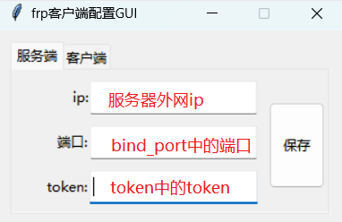

# frp客户端配置GUI

本项目使用·https://github.com/iamxcd/tkinter-helper·进行界面


## 注意事项
- **需要将本程序放到frp的文件夹中使用**
- **必须是阿里云的域名,本程序只对接了阿里云的动态解析,其他的可以自行添加**

## 功能介绍:

- 主要针对需要映射http请求的需求编写,如映射http的接口地址或者web服务地址
- 可视化配置FRP客户端（支持修改新增配置，阿里云解析）


## 使用教程

### 1. 安装frp服务端

> frp开源地址: [https://github.com/fatedier/frp](https://github.com/fatedier/frp)
>
> frp官方文档: [概览 | frp (gofrp.org)](https://gofrp.org/docs/overview/)


这里简单介绍一下安装流程:

* 1.在下面地址中下载frp的程序

  [Releases · fatedier/frp (github.com)](https://github.com/fatedier/frp/releases)

  **linux**系统下载: frp_xxxxx_linux_amd64.tar.gz

* 2.在linux中解压后给frps这个文件开启可执行权限

* 3.配置frps.ini

  参考配置如下:

  ```ini
  [common]
  # 服务端端口
  bind_port = 5443
  # 授权令牌
  token = 123456
  # htpp映射监听端口
  vhost_http_port = 90
  # htpps映射监听端口
  vhost_https_port = 445
  
  #############下方参数懒的话可以不改
  # 用于 kcp 协议的 udp 端口，可以和 'bind_port' 相同
  # 如果未设置，frps 中的 kcp 将被禁用
  kcp_bind_port = 5443
  # 如果你想通过仪表板配置或重新加载 frps，必须设置 dashboard_port
  dashboard_port = 6443
  # 仪表板资产目录（仅用于调试模式）
  dashboard_user = admin
  dashboard_pwd = 963852
  # assets_dir = ./static
  # 控制台或实际日志文件路径，如 ./frps.log
  log_file = ./frps.log
  # debug, info, warn, error
  log_level = info
  log_max_days = 3
  
  # 当很多人一起使用一个 frps 服务器的时候，使用子域配置对于 http、https 类型来说很方便
  #subdomain_host = 
  # 只允许 frpc 绑定你列出的端口，如果你什么都没设置，就不会有任何限制
  #allow_ports = 1-65535
  # 如果任何代理的 pool_count 超过最大值，那么它们将变为 max_pool_count
  max_pool_count = 50
  # 如果使用了 tcp 流多路复用，默认为 true
  tcp_mux = true
  ```

4. 配置systemctl服务启动

   参考[使用 systemd | frp (gofrp.org)](https://gofrp.org/docs/setup/systemd/)

   

### 2. 配置frp客户端

> 在下面地址中下载frp的程序
>
> [Releases · fatedier/frp (github.com)](https://github.com/fatedier/frp/releases)
>
> **windows**系统下载: frp_xxxxx_windows_amd64.zip
>
> 解压后将本程序放到文件夹内

* 1.配置阿里云配置数据

  获取AccessKey ID, AccessKey Secret

  

  

* 2.根据下图所示配置服务端

  > 服务器中记得放行bind_port和vhost_http_port的端口



* 3.配置客户端

  > 注意三级域名后面的点,以及域名第一位的点不能省略,二级域名可以选择随机


说明：

如果不需要三级域名则不填写,二级和一级域名必须填写

点击添加配置后,首先修改当前路径下的frpc.ini的配置文件,在将当前配置的域名,根据你的一级域名去添加解析

新增的域名解析如下图


* 4.最后启动程序,访问frp.132456.google.com:90(90是服务端配置中vhost_http_port的值)，相当于访问本地的127.0.0.1:{本地应用端口}


